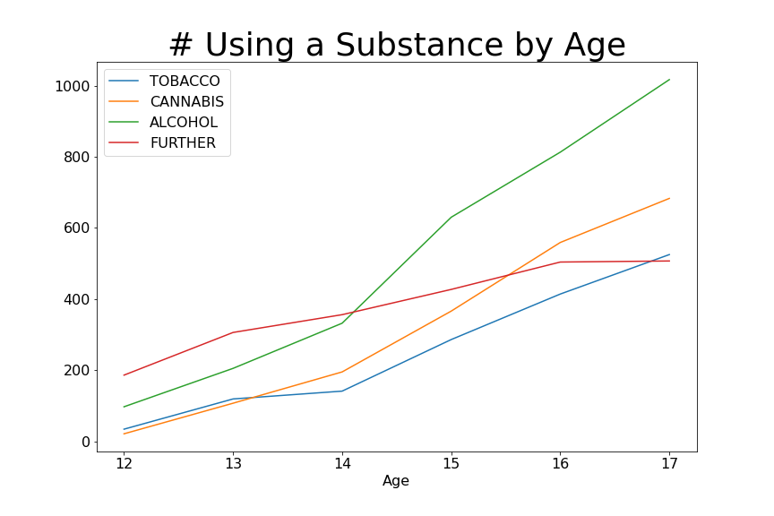
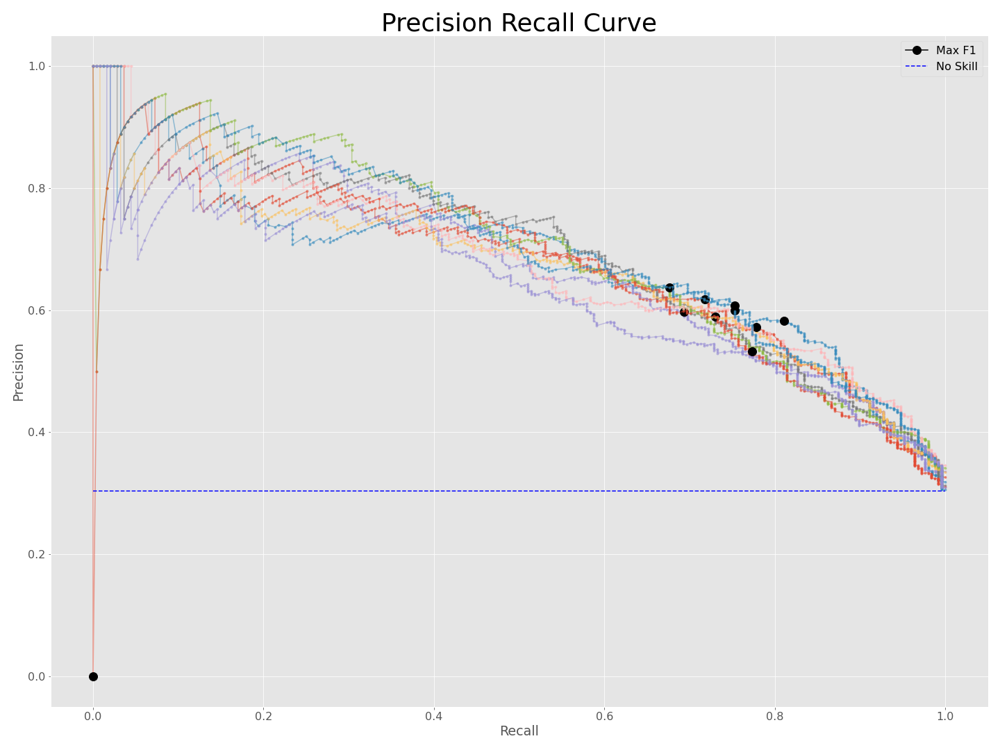
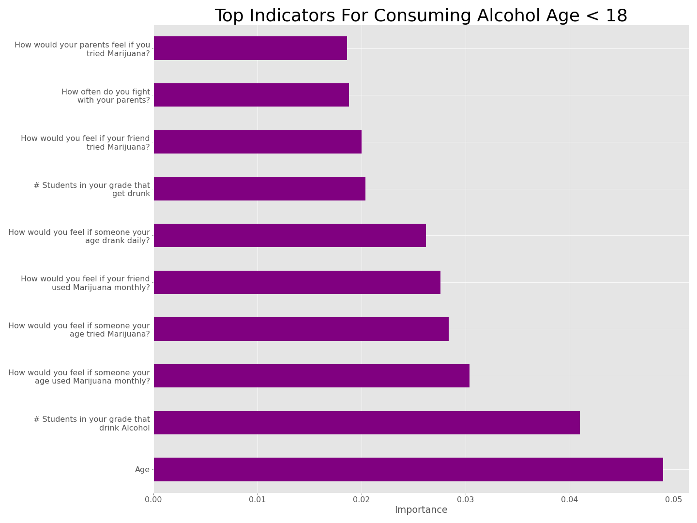

# Childhood Indicators for Alcohol Use in the United States

*Can we figure what leads to adolescent substance experimentation?*

## Contents
 
1. [Motivation](#Motivation)
2. [Data](#Data)
3. [Data Preparation](#Cleaning)
4. [Modeling](#Modeling)
5. [Summary of Findings](#Summary)

-------

## <a name="Motivation">Motivation</a>

Addiction is a lion of a problem. According to a Treatment Episode Data Set [Report](https://www.samhsa.gov/data/sites/default/files/WebFiles_TEDS_SR142_AgeatInit_07-10-14/TEDS-SR142-AgeatInit-2014.pdf) published in 2014, the younger a patient had started to experiment with substances the more likely they were to be seeking treatment for multiple substances at time of admittance. In this, I saw a small part of the problem I could address and work towards improving.

If the most important indicators for adolescent experimentation can be determined, then we can determine how to best delay substance experimentation until adulthood. This focus on delay instead of abstinence simplifies the problem and still yields a positive: a reduction in total dependencies to battle. To start, I will focus on determining underage drinking.

## <a name="Data">Data</a>

Work here is done on data from the Substance Abuse & Mental Health Data Archive (SAMHSA.gov). Specifically, the National Survey on Drug Use and Health for 2019 ([NSDUH-2019-DS0001](https://www.datafiles.samhsa.gov/study-dataset/national-survey-drug-use-and-health-2019-nsduh-2019-ds0001-nid19016))

NSDUH-2019-DS0001
* 56,136 entries
* 2,741 features

The most notable trend found in my exploratory data analysis that was pertinent to my conclusion was age based. Older adolescents were more likely to have experimented with substances across the board. While this is obvious, it's worth noting for the findings.

## <a name="Cleaning">Data Preparation</a>

In `pipeline.py` there are three helper functions to import and clean the data: `youth_df`, `recoder`, and `imputer`.

Of the 56,136 entries there were 13,397 aged 12 - 17 years old. With the help of the survey's companion codebook, 79 features were determined pertinent to this project. The codebook can be found [here](https://www.datafiles.samhsa.gov/sites/default/files/field-uploads-protected/studies/NSDUH-2019/NSDUH-2019-datasets/NSDUH-2019-DS0001/NSDUH-2019-DS0001-info/NSDUH-2019-DS0001-info-codebook.pdf), but if you'd prefer a quick snapshot there is one in this [repo](src/features.md) as well. This is the task of `youth_df`.

The two challenges with this data were the answer coding schema and the large number of NaN values that resulted from it. With the `recoder` function it first will send common 'NaN' answer codes to actual `np.nan` values, make all scales ascend from 0, build our four targets, and drop columns with depreciated importance. This will create 75,483 NaN values (8.3% of our data), but their impact is huge. The data loss from using the buil-tin `dropna` function to prepare for modeling would be 13,319 of our 13,397 entries.

Now that NaNs are properly labeled `imputer` is used to logically assign select NaN values (e.g. NaN -> 0 for number of presentations on tobacco/alcohol/drugs at school during the last year if that interviewee has not attended any school in the last year). This reduced our NaN count to 16,772 and our data loss to 3,203 entries. I moved forward with the resulting 10,194 x 68 DataFrame. 

## <a name="Modeling">Modeling</a>

### Base Model

Recall is the most important metric for this case as a false negative is far more detrimental than a false positive. Our base model will be assuming everyone will drink which has a recall of 100%––so I'm done! Well, this model has an accuracy of 30.3% and gives me nothing useful to predict what led those children to drink, so I'm not done.

### Fitting

I used `train_test_split` to reserve 20% of my data for testing stratified around my target due to the 70-30 imbalance. During training and validation, I used a `StatifiedKFold` cross validation with 10 folds to account for this imbalance. Out of the box Random Forest performed with 48.2% recall.

With the Precision - Recall curve I found a probability threshold to maximize the F1 Score. While recall is my most important metric, my base model is great proof that I'll need more than recall. After setting the threshold at 30.2% I produced a **Training Recall of 77.0%** and fit the model to my entire training set.

 

### Testing and Feature Importance

My model has a **Test Recall of 80.2%**. While this a 29.8% decrease from my base model, it comes with a 47.7% increase in accuracy *and* interpretability.

Feature importance was found using permutation importance. With this method importance is determined by the drop in accuracy from a baseline to when the feature is permuted.

## <a name="Summary">Summary of Findings</a>

Of the top 10 indicators for determining if an adolescent will drink underage 2 are Peer Influence Indicators, 2 are Parental Indicators, 5 are Internal Belief Indicators and 1 is age. Age gives nothing insightful as the older the child is the more likely they are to drink ([above](#Data)). The amount of students in their grade drinking and/or getting drunk is not of interest either as that is exactly what we're working on finding indicators for, just at scale. The remaining 7 features are based on the child's feeling and their relationship with their parent. Thus, if you want your children to not drink underage the best you can do is to fight with them less, and have intentional, directed conversations about tobacco, drug, and alcohol use.
